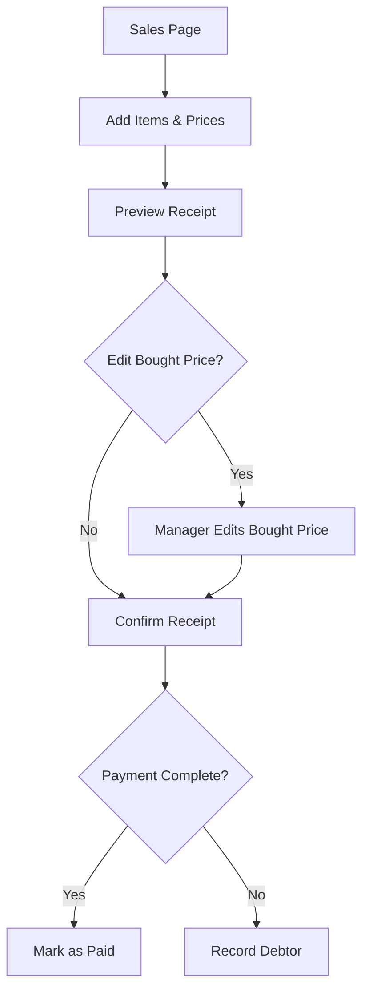
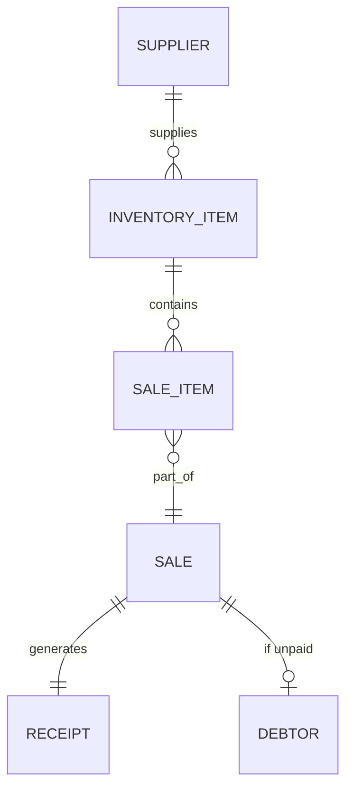

---

```md
# Yesu Dea Wood Ventures Inventory Management System

## 📘 Introduction

The **Inventory Management System (IMS)** for Yesu Dea Wood Ventures is designed to manage the daily operations of a business dealing in wood and building materials. It enables efficient tracking of inventory, recording of sales, management of receipts, debt tracking, and supplier management.

This document outlines the system's architecture, core features, functional behavior, and data models.

---

## 🧱 System Description

### 🎯 Objectives
- Track inventory across multiple categories (e.g., wood, cement, iron rods).
- Allow in-system sales with real-time stock deduction.
- Generate receipts showing bought and sold prices.
- Record customers who owe (debtors), with support for partial payments.
- Provide tools for managing supplier details and supply history.

### 👥 User Roles
| Role        | Permissions                                                                 |
|-------------|-----------------------------------------------------------------------------|
| Admin       | Full access to all system functionalities.                                  |
| Manager     | Inherits Salesperson permissions, can also edit bought prices and manage debtors. |
| Salesperson | Can create sales, view inventory, see bought/sold prices, and print receipts.|

---

## ✅ Functional Requirements

### Inventory Management
- **FR1.1**: Add, edit, remove products from inventory.
- **FR1.2**: Associate items with categories and suppliers.
- **FR1.3**: Track quantity and bought prices.
- **FR1.4**: Show bought prices to all users.

### Sales & Receipts
- **FR2.1**: Select products for sale, specify quantity and sold price.
- **FR2.2**: Bought price is shown (read-only), sold price is editable.
- **FR2.3**: During receipt preview, bought price becomes editable.
- **FR2.4**: Generate two receipt types: customer copy and internal copy.

### Payment & Debtor Tracking
- **FR3.1**: After receipt generation, prompt user to confirm payment status.
- **FR3.2**: If not fully paid, customer is recorded as a debtor.
- **FR3.3**: Track debtor details and outstanding balances.
- **FR3.4**: Allow partial payments over time.

### Supplier Management
- **FR4.1**: Add and update supplier information.
- **FR4.2**: Link items to suppliers and record bought prices.

### Reports
- **FR5.1**: Daily/weekly/monthly sales reports.
- **FR5.2**: Profit report (based on sold vs. bought price).
- **FR5.3**: Debtor summary.
- **FR5.4**: Supplier performance and stock report.

---

## 🧮 System Models

### 🔁 Workflow Diagram (Sales → Payment → Debtor Check)


### 📘 Entity Relationship Model (Simplified)


---

## 📦 Data Model (Updated Interfaces)

```ts
interface InventoryItem {
  id: string;
  name: string;
  category: string;
  quantity: number;
  boughtPrice: number;
  sellPrice: number;
  supplierId: string;
  lastRestocked: Date;
}

interface Sale {
  id: string;
  customerName: string;
  customerContact: string;
  items: SaleItem[];
  totalAmount: number;
  paidAmount: number;
  isPaid: boolean;
  date: Date;
}

interface SaleItem {
  inventoryItemId: string;
  quantity: number;
  sellPrice: number;
  boughtPrice: number; // editable only during receipt preview
}

interface Receipt {
  saleId: string;
  previewStage: boolean;
  editableBoughtPrices: boolean;
}

interface Debtor {
  id: string;
  name: string;
  contact: string;
  totalDebt: number;
  paidAmount: number;
  outstandingBalance: number;
  paymentHistory: {
    amountPaid: number;
    date: Date;
  }[];
}

interface Supplier {
  id: string;
  name: string;
  contact: string;
  supplyHistory: {
    itemId: string;
    quantity: number;
    boughtPrice: number;
    date: Date;
  }[];
}
```

---